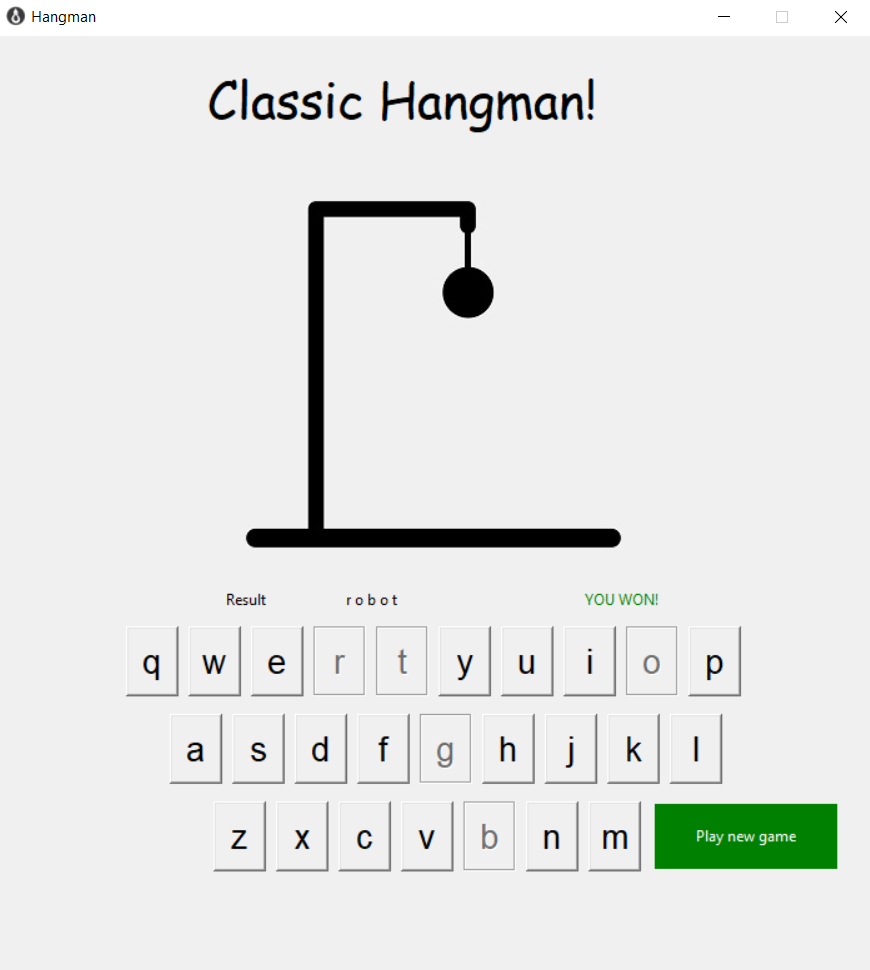

# Hangman

This is the classic Hangman game
It has a database with word in: \db\words.txt (You can add new words freely)

The game window provides you with animated hangman, result, remaining lives, letter guess field, guess button as well as new game button.
To run it just execute the 'main.py' file.

The project can be accessed at: https://github.com/RadoslavTs/Hangman

Created by Lord Radoslav Tsepenishev

